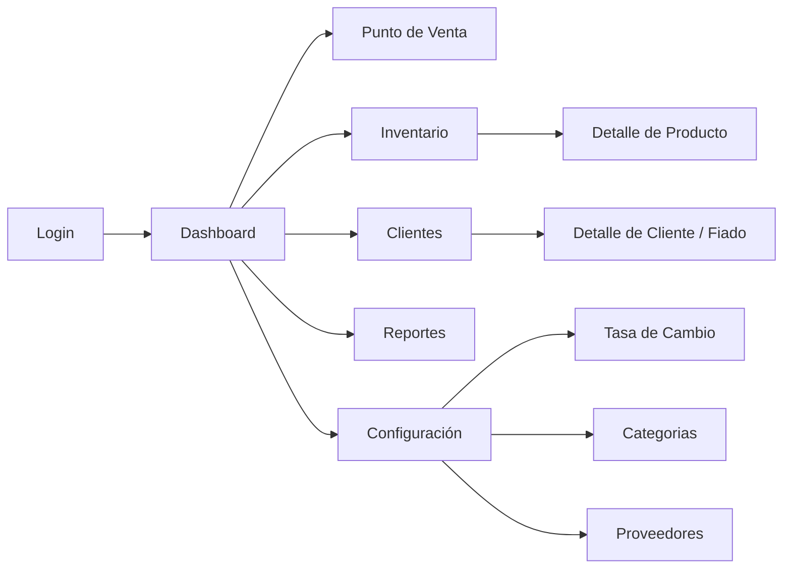
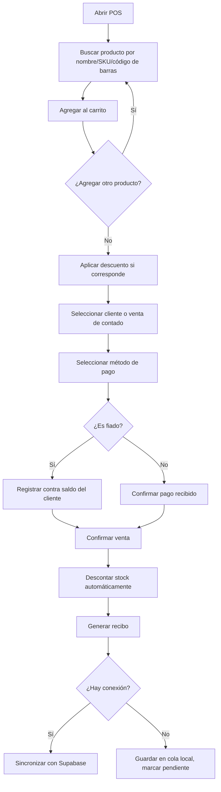
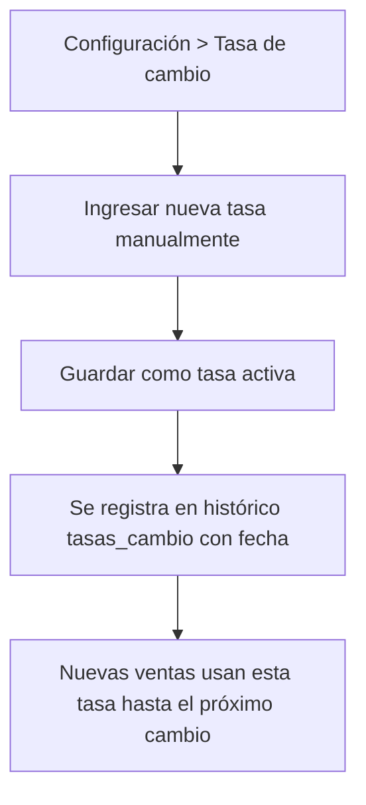
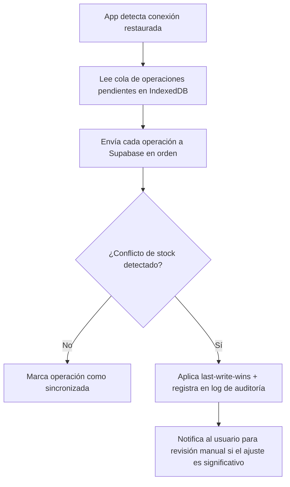

# Flujo de la Aplicación

**Proyecto:** Sistema de Inventario y Control de Ventas
**Versión:** 1.0

## 1. Mapa de pantallas

## 2. Flujo: Venta en el punto de venta (POS)

## 3. Flujo: Alta de producto nuevo
1. Inventario → "Nuevo producto".
2. Completar: nombre, categoría, proveedor, unidad de medida, precio costo (USD), precio venta (USD), stock inicial, stock mínimo, SKU (autogenerado o manual), código de barras (opcional).
3. Guardar → se crea el producto y un movimiento de inventario tipo "entrada inicial".

## 4. Flujo: Ajuste de inventario (compra a proveedor / merma)
1. Inventario → producto → "Registrar movimiento".
2. Tipo: entrada (compra) o salida (merma/daño/ajuste).
3. Cantidad + motivo (obligatorio en salidas no asociadas a una venta).
4. Guardar → actualiza `stock_actual` y crea registro en `movimientos_inventario`.

## 5. Flujo: Actualización de tasa de cambio

*Nota: si pasan más de 24h sin actualizar, el Dashboard debe mostrar una alerta visual (ver UI/UX Brief §7).*

## 6. Flujo: Cobro de fiado
1. Clientes → seleccionar cliente → ver saldo pendiente.
2. "Registrar abono" → monto (USD o Bs, se convierte con la tasa activa) + método de pago.
3. Guardar → descuenta el saldo pendiente, queda en el historial de pagos del cliente.

## 7. Flujo: Sincronización offline → online

## 8. Casos borde a contemplar
- Venta de un producto que se queda sin stock a mitad de captura — *sugerido: advertir pero permitir, con flag para revisión posterior, en vez de bloquear la venta.*
- Anulación de una venta ya sincronizada — debe reponer stock y, si era fiado, revertir el saldo del cliente.
- Venta de contado que después se quiere reasignar a un cliente identificado.
