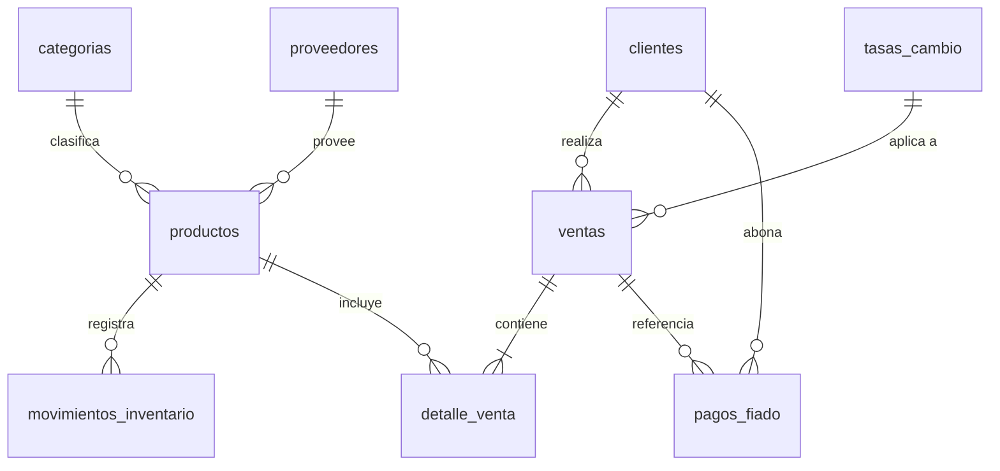

# Esquema del Backend

**Proyecto:** Sistema de Inventario y Control de Ventas
**Motor:** PostgreSQL (Supabase) · **Versión:** 1.0

## 1. Diagrama entidad-relación

## 2. Tablas

### `productos`
| Campo | Tipo | Notas |
|---|---|---|
| id | uuid PK | |
| sku | text unique | código interno |
| codigo_barras | text nullable | opcional — muchos productos de ferretería no lo traen |
| nombre | text | |
| descripcion | text nullable | |
| categoria_id | uuid FK → categorias | |
| proveedor_id | uuid FK → proveedores, nullable | |
| unidad_medida | enum | unidad, caja, metro, kilo, litro, par |
| precio_costo_usd | numeric(10,2) | |
| precio_venta_usd | numeric(10,2) | |
| stock_actual | numeric(10,2) | numeric, no integer — permite metros/kilos fraccionarios |
| stock_minimo | numeric(10,2) | dispara alerta |
| activo | boolean default true | |
| created_at / updated_at | timestamptz | |

### `categorias`
`id`, `nombre`, `descripcion`.

### `proveedores`
`id`, `nombre`, `telefono`, `contacto`, `notas`.

### `movimientos_inventario`
| Campo | Tipo | Notas |
|---|---|---|
| id | uuid PK | |
| producto_id | uuid FK | |
| tipo | enum | entrada, salida, ajuste, venta |
| cantidad | numeric(10,2) | |
| motivo | text nullable | obligatorio si tipo = ajuste/salida manual |
| referencia_venta_id | uuid FK → ventas, nullable | |
| created_at | timestamptz | |

### `clientes`
`id`, `nombre`, `telefono`, `identificacion` (cédula/RIF, nullable), `saldo_fiado` (numeric), `notas`.

### `ventas`
| Campo | Tipo | Notas |
|---|---|---|
| id | uuid PK | |
| cliente_id | uuid FK, nullable | null = venta de contado sin cliente registrado |
| fecha | timestamptz | |
| subtotal_usd | numeric(10,2) | |
| descuento_usd | numeric(10,2) default 0 | |
| total_usd | numeric(10,2) | |
| tasa_cambio_aplicada | numeric(10,4) | **snapshot**, nunca se recalcula |
| total_bs | numeric(12,2) | calculado en el momento de la venta |
| metodo_pago | enum | efectivo_usd, efectivo_bs, pago_movil, transferencia, tarjeta, fiado |
| estado | enum | completada, anulada |
| sincronizado | boolean default true | usado por la cola offline |
| created_at | timestamptz | |

### `detalle_venta`
`id`, `venta_id` FK, `producto_id` FK, `cantidad`, `precio_unitario_usd`, `subtotal_usd`.

### `pagos_fiado`
`id`, `cliente_id` FK, `venta_id` FK nullable, `monto_usd`, `monto_bs`, `metodo_pago`, `fecha`, `notas`.

### `tasas_cambio`
`id`, `fecha`, `tasa` (numeric(10,4)), `fuente` (enum: manual, api), `created_at`.
*Histórico completo — nunca se borra ni edita, solo se agregan filas nuevas.*

## 3. Row Level Security (RLS)
- Todas las tablas: `ALTER TABLE ... ENABLE ROW LEVEL SECURITY;`
- v1 (usuario único): política `USING (auth.uid() IS NOT NULL)` — cualquier usuario autenticado (solo existe uno) puede leer/escribir.
- **Diseñar `profiles.role` desde ahora** (aunque hoy solo exista `admin`) para no tener que migrar RLS cuando se agreguen cajeros — ver §5.

## 4. Índices recomendados
- `productos(sku)`, `productos(codigo_barras)` — búsqueda en POS.
- `ventas(fecha)` — reportes por rango.
- `clientes(identificacion)`.
- `movimientos_inventario(producto_id, created_at)`.

## 5. Consideraciones futuras (no implementar en v1, pero diseñar sin bloquear)
- Tabla `profiles` con `role` (admin, cajero) para cuando se sumen empleados — evita romper RLS después.
- Tabla `sucursales` si el negocio abre una segunda ubicación.
- Campo `factura_fiscal_id` en `ventas` si se confirma requisito de facturación electrónica SENIAT.
